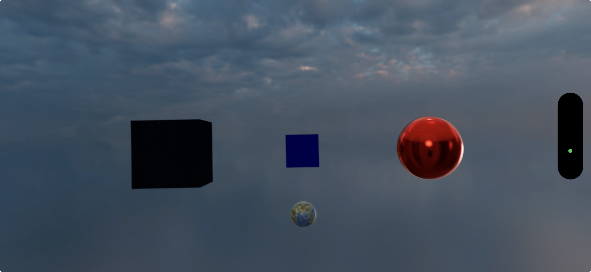
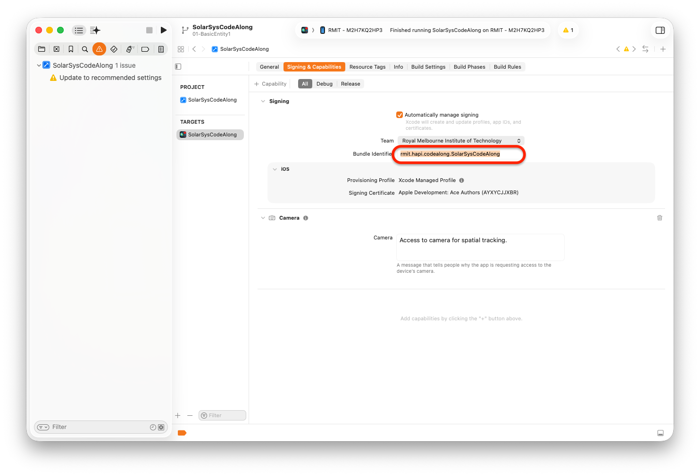
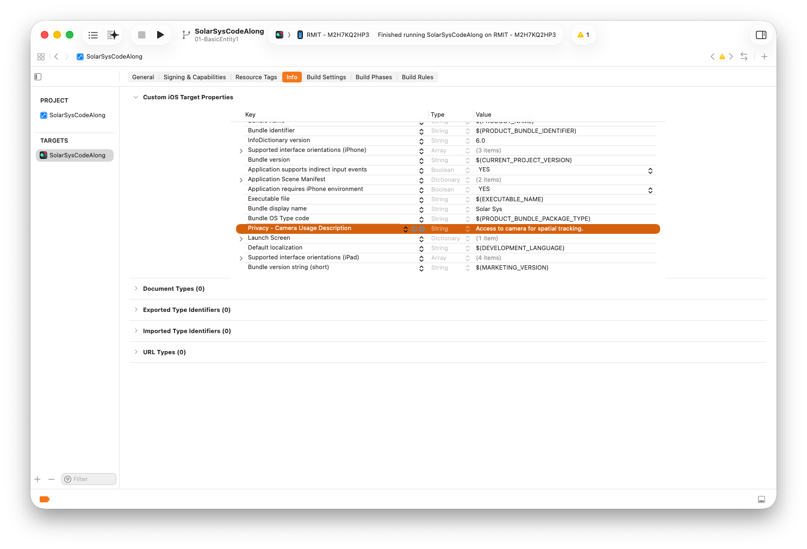

# RealityKit Code Along - Basic Entity

# Source Repository, Github, and Branches

👉 [Source Repository](https://github.com/RMIT-Ace/SolarSysCodeAlong)

This code-along comes with many exercises. Each exercise has a starting point, and its next milestone steps - each in its own 'branch'. For example, for our first exercise, 01-BasicEntity, you will see a branch '01-BasicEntity', then, '01-BasicEntity1' and so on.

You are free to navigate and explore these exercises the way you like. For the curious ones, you can switch to the end milestone of each exercise, build and deploy, play with it, then walk throught the source code. Or, if you are feeling brave, you can swith to the beginning branch and try to code your way to the solution.

# Setup

First off, this code-along will be much more fun if you run this app on the actual iPhone. With this, you will be able to walk around and inspect your 3D models, and etc.

## Update Bundle ID for your app
Apple uses Bundle ID to uniquely identify your app once it is put on the AppStore.
For this code-along purpose, you can make up any string that is unique for this purpose.  For example:

`com.YOUR-FULL-NAME.code-along.SolarSys`

## Add Privacy Usage Description
Your app will access camera for 3D spatial tracking. This allows you to place 3D virtual objects in your room and you can walk around and inspecting them. Very cool!
Apple asks that you must inform this to the users and get their permission first. 

# Test Run
Just as this is our first exercise, let's test building and running on the actual iPhone.

Switch to '01-BasicEntity1' branch, then, build and deploy to your device. You shoud see your Solar Sys app run on your device like the picture shown at the beginning of this post.

# Have Fun
You can walk around your virtual world and inspect these colorful 3D objects and be amazed with them!

In the next post, we will go through the source code and see the most basic fundamental components of Immersive/Spatial applications.

Til then, have fun.

Ace