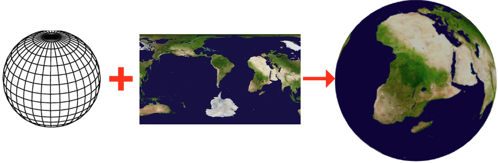
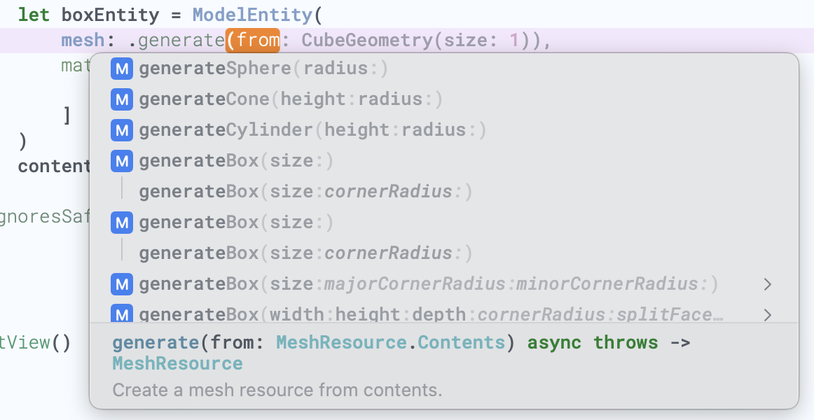
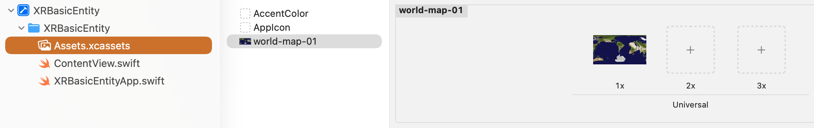
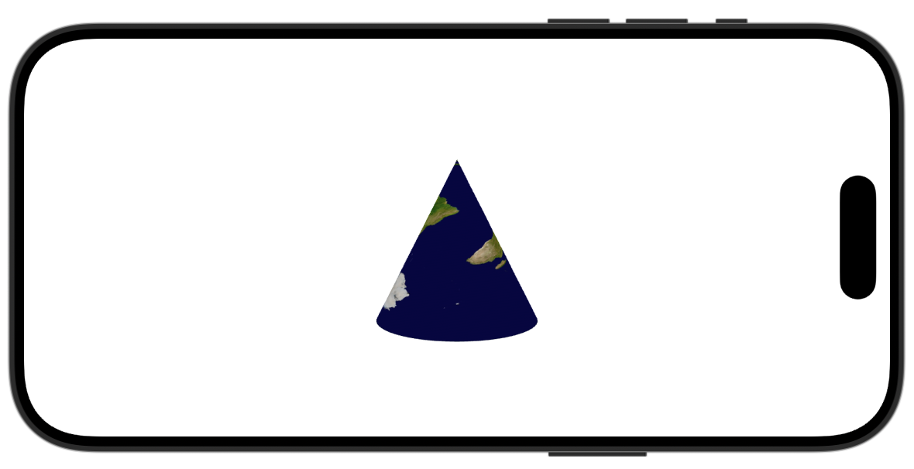
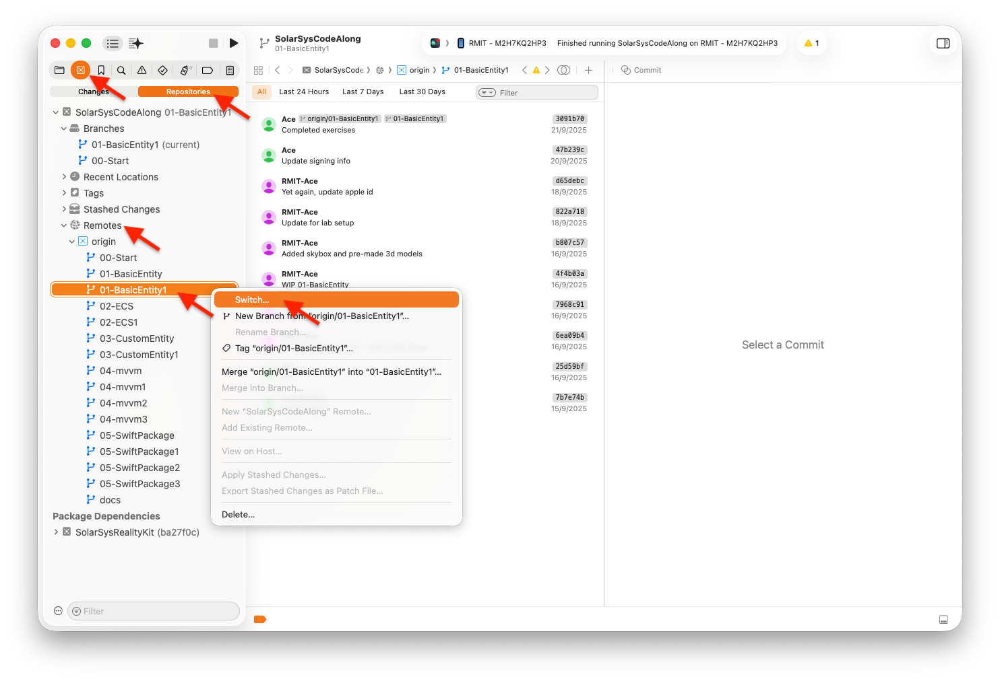

# RealityKit Code Along - Basic Entity



# Source Branches

In this post, we continue from the previous week. We will look at the basic component that makes an object visible in spatial view - the Entity component.

If you arrived here and wondered where the source code for this exercise, here it is:

`https://github.com/RMIT-Ace/SolarSysCodeAlong`

For this week, we will walkthrough code comes from these two git branches:

- `01-BasicEntity`, and
- `01-BasicEntity1`

# Code Walkthrough

To make an entity visible you will need 2 things: mesh and material.

```swift
    let boxEntity = ModelEntity(
        mesh: .generateBox(size: 0.25),
        materials: [
            SimpleMaterial(color: .blue, isMetallic: true)
        ]
    )
    content.add(boxEntity)
```

The code above creates a ModelEntity with a simple 3D-mesh box shape with equal width and height of 0.25 metres (250 cm). This mesh is then overlaid with a simple blue metallic material.



RealityKit framework comes with helper methods to help you quickly create several predefined meshes, for example, to create a mesh in a cone shape:

```swift
    let coneEntity = ModelEntity(
        mesh: .generateCone(height: 1, radius: 0.5),
        materials: [
            SimpleMaterial(color: .blue, isMetallic: true)
        ]
    )
    content.add(coneEntity)
```

For materials, RealityKit comes with several functions to help with creating simple materials, i.e. `SimpleMaterial(color:isMetallic:)`, `UnlitMaterial(color:)`, etc. Alternatively, you can try using your own images as a material.

First, let's add some sample image to our Xcode project. You can use any image, i.e. 'world-map-01'. Simply drag and drop your image into Xcode's 'Assets.xcassets' file.



```swift
    if let texture = try? await TextureResource(named: "world-map-01") {
        let material = UnlitMaterial(texture: texture)
        // ...
    }
```

Let's apply this texture material to our cone shape.

```swift
    if let texture = try? await TextureResource(
        named: "world-map-01") {
        let material = UnlitMaterial(texture: texture)
        let coneEntity = ModelEntity(
            mesh: .generateCone(height: 1, radius: 0.25),
            materials: [material]
        )
        content.add(coneEntity)
    }
```

You should see our cone shape in a new texture as below.

You can add more objects (entities) into your view. Update enities' `transform` to move objects around, i.e.

```swift
// Move object along x, y, and z axis.
coneEntity.transform = Transform(translation: SIMD3(-1, 0, -1))
```

Or resizing them, i.e.

```swift
coneEntity.transform.scale = SIMD3(1.5, 1.5, 1.5)
```



There are five exercises for Basic Entity code-along. See if you can complete these challenges. If you’d like to sneak a look at the answers, it’s in the ‘01-BasicEntity1’ branch.



Coding is fun,

Ace