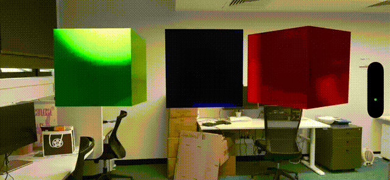

# RealityKit Code Along - Animation with ECS



In this post, we’re continuing to implement 3D animation with RealityKit. This time we’ll explore the suggested framework using Entity, Component and System.

# Source Branches

`https://github.com/RMIT-Ace/SolarSysCodeAlong`

In this post, we will be working on these branches:

- `02-ECS1`

# ECS - Component

In RealityKit, components store information for entities.  We can use a component to manage per-entity state that systems can use.  For instance, we’ll use a component to store rotational operation details (rotation speed and axis of revolution)l for each entity.

```swift
struct RotationComponent: Component {
    var rotationSpeed: Float = 0.0
    var rotationAxis: SIMD3<Float> = [0, 1, 0]
}
```

# ECS - System

In RealityKit, a system represents a continuous operation affecting multiple entities.  Its code is executed on every scene’s update.  RealityKit calls the system’s update function as often as specified by the `updatingSystemWhen` parameter in the `entities(matching:updatingSystemWhen:)` function. This eliminates the need to set up and manage the `runloop` for updating animations.

We can simply focus our code on implementing rotational operations for our entities.

```swift
struct RotationSystem: System {
    static let query = EntityQuery(where: .has(RotationComponent.self))
    
    init(scene: Scene) { }
    
    func update(context: SceneUpdateContext) {
        for entity in context.scene.performQuery(Self.query) {
            guard let rotationComponent = entity.components[RotationComponent.self] else { continue }
            
            let rotationAngle = rotationComponent.rotationSpeed * Float(context.deltaTime)
            let rotation = simd_quatf(angle: rotationAngle, axis: rotationComponent.rotationAxis)
            entity.transform.rotation *= rotation
        }
    }
}
```

As mentioned, the `update()` function affects all entities in the current scene.  In this example, we’re ignoring all other entities except those with a `RotationComponent`.

```swift
    static let query = EntityQuery(where: .has(RotationComponent.self))
    ...
    func update(context: SceneUpdateContext) {
        for entity in context.scene.performQuery(Self.query) {
            ...
        }
    }
```

Next, we’ll retrieve information about the entity’s rotation.

```swift
guard let rotationComponent = entity.components[RotationComponent.self] else { continue }
```

Since we no longer control how often our code is called per second, RealityKit provides `deltaTime`. This records the time elapsed since our function was last called. We’ll use `deltaTime` to fine-tune our rotational operation.

In our case, the amount of rotation angle since last update is calcuated as:

```swift
let rotationAngle = rotationComponent.rotationSpeed * Float(context.deltaTimeo)
let rotation = simd_quatf(angle: rotationAngle, axis: rotationComponent.rotationAxis)
```

And, lastly, we update our component with the new rotation value.

```swift
entity.transform.rotation *= rotation
```

# Using ECS

The entity part of the code remains unchanged. However, I’ve refactored it into a function called `makeBoxEntity()` to avoid repetitive code for creating multiple entities.

```swift
var body: some View {
        RealityView { content in
            ...
            let blueBox = makeBoxEntity(name: "BlueBox", 
                                        color: .blue, 
                                        position: [0, 0, depth])
            content.add(blueBox)
            ...
        }
}
```

To make our `RotationSystem` code operates on an entity, you can simply do:

```swift
blueBox
    .components
    .set(RotationComponent(rotationSpeed: 10.0, rotationAxis: [0, -1, 0]))
```

Finally, you need to inform RealityKit about the new system `RotationSystem` so it can call it whenever the scene updates.  This only needs to be done once per app run.

```swift
var body: some View {
        RealityView { content in
            ...
        }
        .onAppear(){
            RotationSystem.registerSystem()
        }
}
```

View the complete source code from the GitHub branch `02-ECS1`.  Build and run it on your device to see how easily each code component can be reused. For example, you can create three boxes and make them rotate independently.

