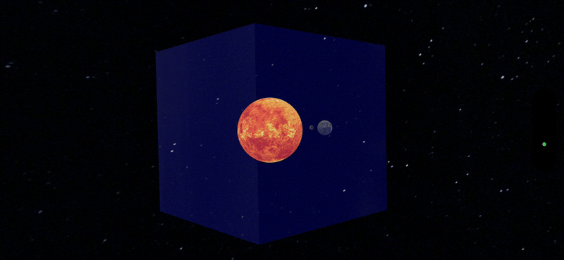

# RealityKit Code Along - ECS



# Source Branches

`https://github.com/RMIT-Ace/SolarSysCodeAlong`

In this post, we will be working on these branches:

- `02-ECS`, and it's counterpart - the answer
- `02-ECS1`

# Simple Sky Box (a.k.a Sky Dome)

What is a sky dome? Or a sky box?

Imagine stepping into a VR world inside a large box or dome.  The inside walls are painted with your chosen picture creating a completely immersive experience.

The following code does just that.

```swift
if let hapiLabTexture = try? await TextureResource(named: "starfield") {
    let mesh = MeshResource.generateSphere(radius: 10)
    let material = UnlitMaterial(texture: hapiLabTexture)
    let hapiSphere = ModelEntity(mesh: mesh, materials: [material])
    content.add(hapiSphere)
    hapiSphere.transform.scale = SIMD3(-1, 1, 1)
}
```

Spot anything unusual?

At first glance, this code appears quite simple. It’s designed to display an entity within our virtual reality world.  We begin by loading our “starfield” texture from the asset resource.

```swift
let hapiLabTexture = try? await TextureResource(named: "starfield")
```

Then we create a mesh structure. We used a sphere (think of it as a dome) of size 10 metres.

```swift
let mesh = MeshResource.generateSphere(radius: 10)
```

A 10-metre dome is quite large.  Our object is initially positioned at the centre of our VR universe at (0, 0, 0).  Running the app will make you appear to be inside this dome.

So far so good. But, what about this scaling operation here?

```swift
    hapiSphere.transform.scale = SIMD3(-1, 1, 1)
    //                                 ^ 
    //                                 |
    //                                 `-- ???
```

Typically, textures are applied to an object’s outer layer.  However, scaling with a negative value causes them to be applied inside instead.  This is a handy trick for blocking out the outside world and fully immersing yourself in your makeup world.

Feel free to experiment with various images. Become a master of your own universe and immerse yourself completely in your personal matrix.

Have a great time coding until next time!

Ace