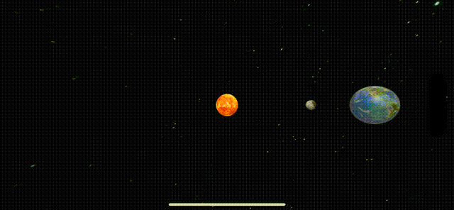

# RealityKit Code Along - Create Heavenly Objects



# Source Branches

`https://github.com/RMIT-Ace/SolarSysCodeAlong`

In this post, we will be working on these branches:

- `02-ECS2`

# SolarSysRealityKit - A Swift Package

This week, we’ll simulate objects and their behaviours within the Solar System.  Instead of manually searching for images, we’ll leverage the SolarSysRealityKit package, thanks to Swift Package Manager.

`https://github.com/RMIT-Ace/SolarSysRealityKit`

This package offers images of the Sun, Moon and Earth.  Here’s how to add a Swift package to our Xcode project.


To use this package in our souce code, we simply import it in.

`import SolarSysRealityKit`

This enables us to utilise resources such as images from this package for example.

```swift
if let url = SolarSysRealityKitResources.bundle.url( forResource: "Sun", withExtension: "usdz") {
    if let sun = try? await ModelEntity(contentsOf: url) {
        content.add(sun)
        ...
    }
    ...
}
```

Let’s create an entity to represent the Sun.  You’ll notice these codes are quite standard, having been learned from previous weeks.  To make the Sun rotate, we’ll reuse our `RotationComponent` from the last post.

```swift
if let sun = try? await ModelEntity(contentsOf: url) {
    content.add(sun)
    sun.transform = Transform(translation: SIMD3(0, 0, depth))
    sun.scale = SIMD3(repeating: 4)
    sun.components.set(
        RotationComponent(rotationSpeed: 1.0, rotationAxis: [0, -1, 0])
    )
}
```

Creating an entity for Earth is possible using the same method. 

```swift
if let url = SolarSysRealityKitResources.bundle.url( forResource: "Earth", withExtension: "usdz") {
    if let earth = try? await ModelEntity(contentsOf: url) {
        earth.position.x = boxSize / 2.0
        earth.components.set( RotationComponent(rotationSpeed: 5.0) )
        ...
    }
}
```

Adding Earth to the Sun is simply adding a child entity to the Sun entity.

```swift
    if let earth = try? await ModelEntity(contentsOf: url) {
        ...
        sun.addChild(earth)
        ...
    }
```

The complete source code is available on the Github branch above.  Build and run it to see our heavenly bodies – the Sun, Earth and Moon – rotating. It’s fascinating! 

# Optical Illusion!

When you add Earth to the Sun, it spins on its axis and also appears to orbit the Sun.  This orbital speed matches the Sun’s rotation speed, creating a simple optical illusion.  Forget about the Sun, Earth and Moon for a moment and consider this abstractly.  When you add an entity to its parent it becomes part of that parent.  Therefore, when a parent entity rotates all its parts rotate with it.

What would happen if we wanted Earth to orbit the Sun independently at a different speed and/or direction?

Hold on to that thought for now. We’ll address this behaviour in our next post.

"The ultimate Answer to Life, the Universe and Everything is ... 42!" -- Douglas Adams.

Ace