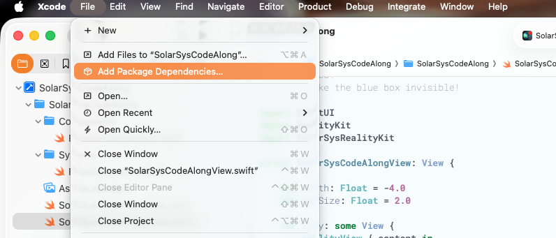
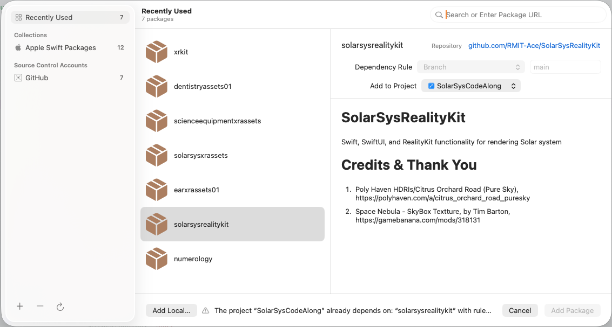

# RealityKit Code Along - Create Heavenly Objects


# Source Branches

`https://github.com/RMIT-Ace/SolarSysCodeAlong`

In this post, we will be working on these branches:

- `02-ECS2`

# SolarSysRealityKit - A Swift Package





`https://github.com/RMIT-Ace/SolarSysRealityKit`

This allows us to use resources like images from this package. For example.

```swift
if let url = SolarSysRealityKitResources.bundle.url( forResource: "Sun", withExtension: "usdz") {
    if let sun = try? await ModelEntity(contentsOf: url) {
        content.add(sun)
        ...
    }
    ...
}


```

Creating Sun with rotation.

```swift
if let sun = try? await ModelEntity(contentsOf: url) {
    content.add(sun)
    sun.transform = Transform(translation: SIMD3(0, 0, depth))
    sun.scale = SIMD3(repeating: 4)
    sun.components.set(
        RotationComponent(rotationSpeed: 1.0, rotationAxis: [0, -1, 0])
    )
}
```

Create Earth.

```swift
if let url = SolarSysRealityKitResources.bundle.url( forResource: "Earth", withExtension: "usdz") {
    if let earth = try? await ModelEntity(contentsOf: url) {
        earth.position.x = boxSize / 2.0
        earth.components.set( RotationComponent(rotationSpeed: 5.0) )
        ...
    }
}
```

Add Earth to Sun.

```swift
    if let earth = try? await ModelEntity(contentsOf: url) {
        ...
        sun.addChild(earth)
        ...
    }
```

The complete source code is available from Github branch above. Build and run, you will see our heavenly object, the Sun, Earth, and the Moon rotating. How fascinating! 

Notice that by adding Earth to Sun entity, Earth is not just rotating around itself, but also orbiting around the Sun. This effect also happens with the Moon.