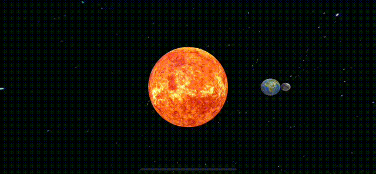

# RealityKit Code Along - Custom Entity



In our previous post, we explored how Entity, Component and System (ECS) simplifies coding immersive applications. However, we encountered two problems:

1. Code repetition.
2. A child entity’s rotation is dependent on its parent’s rotation.

# DRY - Don't Repeat Yourself

To avoid code repetition, we create a custom class to represent celestial bodies within our universe.

```swift
class CelestialEntity: Entity {
    
    required init() {
        fatalError("init() has not been implemented")
    }
    
    required init?(
        bundle: Bundle = .main,
        name: String,
        scale: Float = 1.0,
        distanceFromCenter: Float) async
    {
        super.init()
        ...
    }
    ...
}
```

The first initialiser prevents us from calling it without all the necessary arguments.  We’ll use the second initialiser to create our solar objects, for example.

```swift
let sun = CelestrialEntity("Sun", distanceFromCenter: 0.0)      // Sun is at the center.
let earth = CelestrialEntity("Earth", distaneFromCenter: 1.0)   // i.e. 1 meter from the sun.
```

# Double Bodies

How can we solve our second problem?  Specifically, how do we rotate a parent entity without causing its child entities to rotate along with it?

One approach is to use double bodies. 

```
- Celestrial Object
    |
    |- Main body - body that has appearance and spinning
    |
    `- Rigid body - body with no appearance and does not spin
```

We attach a `RotationComponent` and materials to the main body.  Then we attach any child satellites to the `Rigid body`.

```swift
required init?(
        bundle: Bundle = .main,
        name: String,
        scale: Float = 1.0,
        distanceFromCenter: Float) async
    {
        super.init()
        
        // MainBody - The body that spins. Also this body has visual apperance, i.e. materials.
        guard let url = bundle.url(forResource: name, withExtension: "usdz"),
              let celestialObj = try? await ModelEntity(contentsOf: url) else {
            print("ERROR: loading model")
            return nil
        }
        self.name = name
        celestialObj.name = "MainBody"
        celestialObj.transform = Transform(
            scale: SIMD3(repeating: scale),
            translation: .init(x: distanceFromCenter, y: 0, z: 0)
        )
        addChild(celestialObj)
        
        // The rigid body (doesn't spin) - for adding children. No Visual appearance..
        let nonRotatingMainBody = Entity()
        nonRotatingMainBody.name = "NonRotatingMainBody"
        nonRotatingMainBody.transform = Transform(
            translation: .init(x: distanceFromCenter, y: 0, z: 0)
        )
        addChild(nonRotatingMainBody)
    }
```

We need to modify the `addChild()` function so that the child is attached to the right body.

```swift
func addChild(_ child: Entity) {
        guard let mainBody = findEntity(named: "NonRotatingMainBody") else {
            print("WARN: Entity \(name) does not have main body.")
            super.addChild(child)
            return
        }
        
        mainBody.addChild(child)
}
```

Our celestial object has two movements: rotation around its own axis and orbit around a central point.

```swift
    func updateRotation(speed: Float) async {
        guard let entity = findEntity(named: name),
              let firstChild = entity.findEntity(named: "MainBody") else {
            print("ERROR: failed to find entity with name: \(name)")
            return
        }
        firstChild.components[RotationComponent.self] = RotationComponent(
            rotationSpeed: speed,
            rotationAxis: [0, 1, 0 ]
        )
    }

    func updateOrbit( speed: Float) async {
        components[RotationComponent.self] = RotationComponent(
            rotationSpeed: speed,
            rotationAxis: [0, 1, 0]
        )
    }
```

# Creating Celestrial Bodies

```swift
if let sun = await CelestialEntity(name: "Sun", scale: 4.5, distanceFromCenter: 0.0) {
    root.addChild(sun)

    let earth = await CelestialEntity(name: "Earth", scale: 1.0, distanceFromCenter: 1.0) {
        sun.addChild(earth)
    }
}
```

To make the objects rotate we need to call `updateRotation()` and `updateOrbit()` for each one.

```swift
var body: some View {
    RealityView { content in
    ...
    } update: { content in
        Task {
            await sun.updateRotation(speed: standardSpeed / 27.0) 
            await earth.updateRotation(speed: standardSpeed / 1.0)
            await earth.updateOrbit(speed: standardSpeed / 10)    
        }
    }
}
```

Full source code is available from
`https://github.com/RMIT-Ace/SolarSysCodeAlong`
- branch: `03-CustomEntity1`.

By studying the full source code, building and deploying it to your device or simulator, you should observe our three celestial bodies spinning and orbiting.

At this stage, you’ll have acquired sufficient knowledge to simulate our entire solar system including the Sun and its eight planets. I’ll leave this task for your curiosity and brevity.


*"Three things cannot long be hidden: the sun, the moon, and the truth"* -- Lord Buddha.


Ace